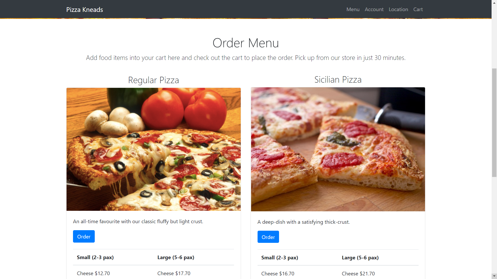

# restaurant ordering web app
## Django Web App with Python and JavaScript
This is a simple restaurant website that allows customers to make orders for food and restaurant
owner to keep track of orders. 

### https://courses.edx.org/courses/course-v1:HarvardX+CS50W+Web/course/



## Usage
* Choose and customised pizza
* Sign in to place order from cart
* Check order status. 
* Admin page at /adminsite for admin to check all submitted orders.
* Admin page can allow admin to keep track of submitted orders
 
## Setup

```bash
# Clone repo
$ git clone this repository

$ cd restaurant-site

# Install all dependencies
$ pip install -r requirements.txt

# Initialise database and make migrations (sqlite)
$ python manage.py makemigrations
$ python manage.py migrate

# Create superuser to access /admin and /adminsite
$ python manage.py createsuperuser

# Run
$ python manage.py runserver

# Go to IP address on your web browser.

# Input menu items into database through /admin and credentials for superuser
```

### DB Schema

Pizza:

CustomisedPizza:

Order:

SubmittedOrder:

Topping: